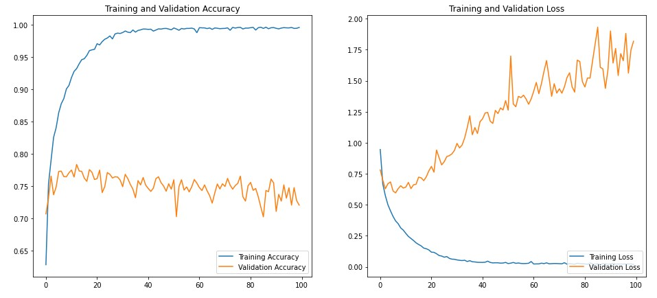

# Face Image Classification (Based on ethnicity)

Face Image Classification is an image classification project. The aim is to use various pre trained deep neural networks and transfer learning to build a classifier that can identify faces of different ethnicities.

## Data

The dataset used for this project is the UTKFace dataset available at the link below. It is a large scale dataset containing more than 20,000 images of faces all the way from ages 0 to more than 100 years old. There are 5 classes which are Asian, Black, Indian, White and Others. Since my aim is to build a classifier and explore the different methods of training and tuning deep learning models, I have trimmed down the dataset to include the 4 main classes (Asian, Black, Indian and White) and only ages between 15 and 50.

Source: https://susanqq.github.io/UTKFace/

## Model details

- The trimmed down dataset contains over 14000 images. This dataset is split into training and validation sets (80% training and 20% validation).
- Training a deep neural network from scratch requires a lot of time and computing resources. Instead we can use transfer learning where we get a pre-trained model and tune it to our specific data.
- For the first few experiments we use the VGG 16 Convolutional Neural Network trained on the imagenet dataset

### Basic workflow

- Import the VGG16 CNN from keras without the top dense layers. We will build our own fully connected layers and experiment with them
- Build our top dense layers
- Train the model and evaluate using the validation dataset
- Try and improve the model performance by exploring different methods

## Results

### Trial 1

- Base Model: VGG16 (Weights - frozen/non trainable)
- Top layer: 2 Dense layers with 1024 and 512 nodes
- Activation: ReLU
- Optimization: ADAM (Learning rate - 0.00001)
- Epochs: 100

#### Interpretation
- Training accuracy got close to 100% but validation accuracy peaked at 78% and slowly started dropping down to 72.5%
- Training loss decreased constantly and stabilized at 0 while validation loss kept increasing and fluctuating and peaked at 1.9.
- The model is clearly overfitting.

### Trial 2

#### Changes
- Added dropout layers for each fully connected layer
- Changed the optimization function to RMSProp
- Learning rate dropped to 0.0001
- Used L2 Regularization

- Base Model: VGG16 (Weights - frozen/non trainable)
- Top layer: 2 Dense layers with 1024 and 512 nodes with a dropout layer with 50% drop probability for each dense layer
- Activation: ReLU
- Optimization: RMSProp (Learning rate - 0.0001)
- Epochs: 100
